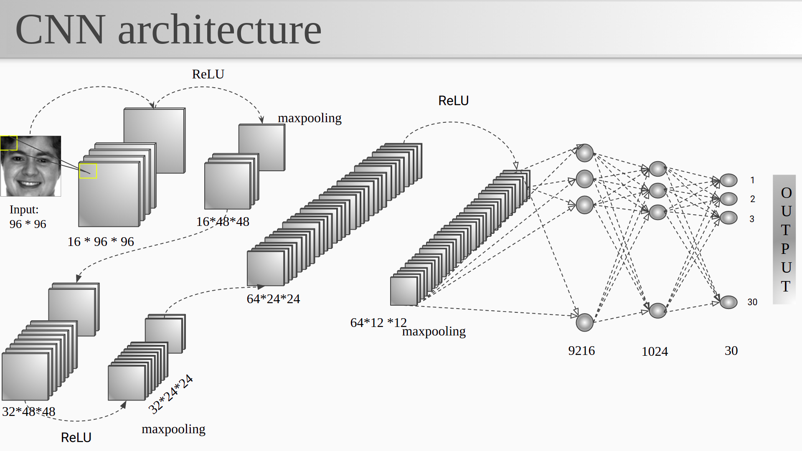
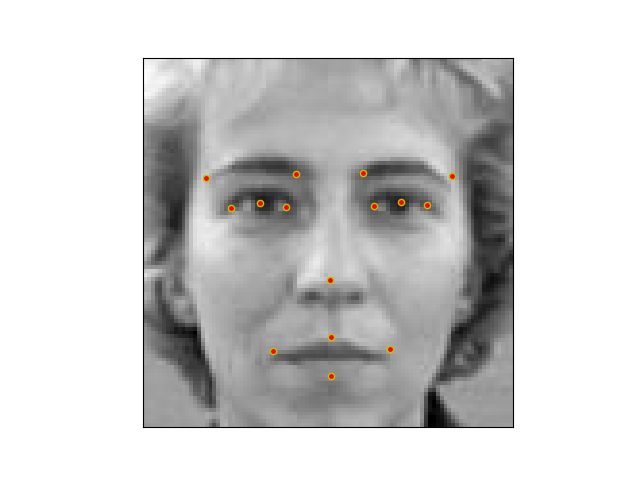

# Facial-Keypoint-Detection

### *Google Slides Presentation*
[Presentation_link](https://docs.google.com/presentation/d/1KPSueCrE0fJeTyjajLtvz2Chc0XFCJFt0rtyjsphYrM/edit?usp=sharing)


# Getting Started

Create a virtual environment and activate it
```
python3 -m venv ./venv
source venv/bin/activate
```
Installing cuda requires following commands(Refer to the official site)
```
wget https://developer.download.nvidia.com/compute/cuda/repos/ubuntu2004/x86_64/cuda-ubuntu2004.pin

```
```
sudo mv cuda-ubuntu2004.pin /etc/apt/preferences.d/cuda-repository-pin-600
```
```
wget https://developer.download.nvidia.com/compute/cuda/11.3.1/local_installers/cuda-repo-ubuntu2004-11-3-local_11.3.1-465.19.01-1_amd64.deb
```
```
sudo dpkg -i cuda-repo-ubuntu2004-11-3-local_11.3.1-465.19.01-1_amd64.deb
```
```
sudo apt-key add /var/cuda-repo-ubuntu2004-11-3-local/7fa2af80.pub
```
```
sudo apt-get update
```
```
sudo apt-get -y install cuda
```

Installing torch packages ( For cpu only, refer to the pytorch official site to install for gpu or any other help)
```
pip3 install torch==1.8.1+cu111 torchvision==0.9.1+cu111 torchaudio==0.8.1 -f https://download.pytorch.org/whl/torch_stable.html
```


## **About the data**

The data is taken from one of the kaggle competitions [dataset_link](https://www.kaggle.com/c/facial-keypoints-detection/data.)


## **Setup**
Download the data from the above link and keep extract training.csv and test.csv in one single directory.
Then fork all the .py and .ipynb files and keep all of them into the same directory where the data is.

## **Training**
Run the training.ipynb to start the training.(all data files .py files should be under same directory, otherwise give the path accordingly)

## Trained model
Download the trained model from the google drive [model_link](https://drive.google.com/file/d/1iKpoxyaQ7QX6zCxukkX7evi2UNH96YwC/view?usp=sharing)

Note: This model is necessary for testing.ipynb and deploy folder. Keep the model in both place. 

# *THE MODEL*



This is the whole architecture and we performed non-linear regression to predict the keypoints.


__________________________________________________________________________________________________________________________________________________________________
__________________________________________________________________________________________________________________________________________________________________
__________________________________________________________________________________________________________________________________________________________________
__________________________________________________________________________________________________________________________________________________________________

## **Local Deployment**
Copy the model in deploy folder and then

Run the file main.py from the deploy directory by the command

```
  python3 main.py
```
it will start the backend server. Then double click on the index.html to start the local webpage. One example image(RGB) is given in the deployment directory to see the deployment.


# Example
```
Original Image
```


```
Prediction of keypoints
```



### References:
1. https://ieeexplore.ieee.org/document/9065279

2. https://arxiv.org/abs/1710.05279

3. https://towardsdatascience.com/facial-keypoints-detection-image-and-keypoints-augmentation-6c2ea824a59

4. https://github.com/yinguobing/cnn-facial-landmark

5. https://debuggercafe.com/advanced-facial-keypoint-detection-with-pytorch/

6. https://medium.com/diving-in-deep/facial-keypoints-detection-with-pytorch-86bac79141e4
